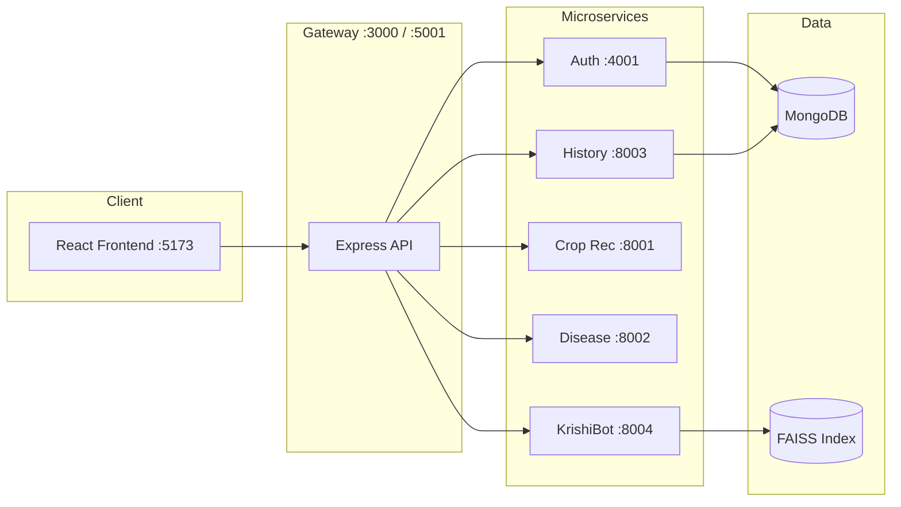

# 🌾 AgroVision - AI-Powered Agricultural Platform

AgroVision is a **microservices-based** web platform for farmers and agri-advisors. It combines **machine-learning crop tools** (including **EfficientNetB0 transfer learning** for leaf disease detection), a **multilingual dashboard**, and **KrishiBot**—an AI assistant with text and **Whisper-powered voice**—to help with soil-based planning, plant disease diagnosis, and everyday farming questions.

---

## Table of contents

- [Features](#-features)
- [Architecture](#-architecture)
- [Tech stack](#-tech-stack)
- [Project structure](#-project-structure)
- [Services & ports](#-services--ports)
- [API reference (Gateway)](#-api-reference-gateway)
- [Disease detection](#-disease-detection)
- [Crop recommendation](#-crop-recommendation)
- [KrishiBot (chatbot)](#-krishibot-chatbot)
- [Frontend modules](#-frontend-modules)
- [Getting started](#-getting-started)
- [Environment variables](#-environment-variables)
- [Multilingual support](#-multilingual-support)
- [Troubleshooting](#-troubleshooting)
- [Authors & acknowledgments](#-authors--acknowledgments)

---

## ✨ Features

| Feature | Description |
|---------|-------------|
| **Crop recommendation** | ML model suggests suitable crops from N, P, K, pH, temperature, humidity, and rainfall—or fetches weather from GPS coordinates. |
| **Disease detection** | Upload a leaf photo; **EfficientNetB0 + transfer learning** (ImageNet backbone, custom head) classifies **38** crop/disease labels with confidence and Hindi/Punjabi names. |
| **KrishiBot** | RAG + **Gemini** chatbot; **OpenAI Whisper** (STT) + **gTTS** (TTS) for voice; quick actions and in-app tool guidance. |
| **Multilingual UI** | English, Hindi, and Punjabi across dashboard, results, and chat. |
| **History** | Gateway logs recommendations, scans, and chat sessions per user (MongoDB). |
| **Weather** | Open-Meteo + geolocation on the dashboard for local conditions. |
| **Auth** | JWT registration/login; protected AI routes. |

---

## 🏗 Architecture

All browser traffic goes through the **React frontend** → **API Gateway** (JWT) → individual microservices. Python AI services do not expose public auth; the gateway forwards requests and writes audit logs.



---

## 🛠 Tech stack

| Layer | Technologies |
|-------|----------------|
| **Frontend** | React 18, Vite, Tailwind CSS, Lucide Icons, react-i18next |
| **API Gateway** | Node.js, Express, Multer (uploads), JWT middleware |
| **Auth / History** | Node.js, Express, MongoDB |
| **Crop recommendation** | Python 3.11, FastAPI, scikit-learn, pickle models |
| **Disease detection** | Python 3.11, FastAPI, TensorFlow/Keras, **EfficientNetB0** (ImageNet transfer learning) |
| **KrishiBot** | FastAPI, LangChain, FAISS, HuggingFace embeddings, Google Gemini, **OpenAI Whisper** (HuggingFace `transformers`), gTTS |
| **Infrastructure** | Docker Compose, optional Redis (gateway caching) |

---

## 📁 Project structure

```text
Agro-vision/
├── frontend/
│   └── src/
│       ├── components/features/
│       │   ├── ChatbotModule.jsx          # KrishiBot UI
│       │   ├── DiseaseDetectionModule.jsx # Leaf scan UI
│       │   └── CropRecommendationModule.jsx
│       ├── pages/Dashboard.jsx
│       └── config.js                      # API_BASE_URL → gateway
├── agri-microservice/
│   ├── gateway/                           # Single entry point for frontend
│   ├── auth-service/
│   ├── history-service/
│   ├── crop-recomendation-system/          # Port 8001
│   ├── disease-detection/                 # Port 8002
│   │   ├── app/
│   │   │   ├── models/disease_model.py    # EfficientNetB0 + 38 classes
│   │   │   ├── services/detection_service.py
│   │   │   ├── routes/detection_routes.py
│   │   │   └── utils/translator.py        # hi/pa disease name dictionary
│   │   ├── models/model.weights.h5
│   │   └── notebook/Final_Plant_Disease_Detection.ipynb
│   └── krishibot/                         # Port 8004
│       └── voice/
│           ├── speech_to_text.py          # Whisper ASR (transformers pipeline)
│           ├── text_to_speech.py          # gTTS
│           └── voice_service.py           # STT + TTS orchestration
├── docker-compose.yml
├── agro.ps1
└── RUN_ALL_SERVICES.ps1
```

---

## 🔌 Services & ports

| Service | Container name | Host port | Internal port | Notes |
|---------|----------------|-----------|---------------|--------|
| Frontend | `agro-frontend` | 5173 | 5173 | `VITE_API_URL=http://localhost:3000` in Docker |
| Gateway | `agro-gateway` | **3000** | 5001 | Maps host 3000 → container 5001 |
| Auth | `agro-auth` | 4001 | 4001 | MongoDB user store |
| History | `agro-history` | 3002 | 8003 | Activity logs |
| Crop recommendation | `agro-croprec` | 8001 | 8001 | |
| Disease detection | `agro-disease` | 8002 | 8002 | Requires `model.weights.h5` |
| KrishiBot | `agro-krishibot` | 8004 | 8004 | Requires `krishibot.env` + FAISS ingest |
| MongoDB | `agro-mongo` | 27017 | 27017 | |
| Redis | `agro-redis` | 6379 | 6379 | Optional; gateway can disable |

**Health checks (direct, no JWT):**

- Disease: `GET http://localhost:8002/` — model load status, class count  
- KrishiBot: `GET http://localhost:8004/api/health`  
- Crop: `GET http://localhost:8001/`

---

## 📡 API reference (Gateway)

Base URL: `http://localhost:3000` (Docker) or `http://localhost:5001` (local gateway).

| Method | Endpoint | Auth | Description |
|--------|----------|------|-------------|
| POST | `/api/auth/register` | No | Create account |
| POST | `/api/auth/login` | No | Get JWT |
| POST | `/api/auth/verify` | No | Verify token |
| POST | `/api/recommend` | JWT | Crop recommendation (JSON body) |
| POST | `/api/disease-detect?language=en` | JWT | Leaf image upload (`multipart/form-data`, field `file`) |
| GET | `/api/history` | JWT | User activity log |
| POST | `/api/chatbot/ask-text` | JWT | Text question to KrishiBot |
| POST | `/api/chatbot/ask-voice` | JWT | Voice audio upload |
| GET | `/api/chatbot/audio/:filename` | No | TTS MP3 from KrishiBot |
| GET | `/api/health` | JWT | Gateway + downstream service status |

---

## 🔬 Disease detection

The **disease-detection** microservice identifies plant health from **RGB leaf images** using a deep-learning model built with **transfer learning**: a pretrained **EfficientNetB0** backbone (ImageNet) plus a custom classification head trained on plant-disease data.

### ML model: EfficientNetB0 + transfer learning

Instead of training a CNN from scratch, AgroVision **reuses ImageNet features** and fine-tunes for agriculture:

| Stage | What happens |
|-------|----------------|
| **1. Backbone** | `tf.keras.applications.EfficientNetB0(weights="imagenet", include_top=False)` — convolutional layers pretrained on ImageNet |
| **2. Freeze base** | Backbone set `trainable = False` during initial training so low-level edges/textures stay stable |
| **3. Custom head** | `GlobalAveragePooling2D` → `Dense(256, relu)` → `Dense(38, softmax)` — new layers learn crop/disease-specific patterns |
| **4. Fine-tune** | (Notebook) Unfreeze top layers and train on the PlantVillage-style dataset with augmentation |
| **5. Deploy** | Saved weights in `models/model.weights.h5`; inference rebuilds the same architecture in `disease_model.py` |

**Architecture (inference / serving):**

```text
Input (224×224×3 RGB)
  → EfficientNet preprocess_input
  → EfficientNetB0 backbone (ImageNet weights, frozen at inference)
  → GlobalAveragePooling2D
  → Dense(256, ReLU)
  → Dense(38, Softmax)  →  crop + disease class + confidence
```

**Why transfer learning?** Plant leaf datasets are smaller than ImageNet; starting from a strong visual backbone improves accuracy and trains faster than a random initialization.

Training & evaluation: `agri-microservice/disease-detection/notebook/Final_Plant_Disease_Detection.ipynb`.

### How it works

1. User uploads JPG/PNG in `DiseaseDetectionModule.jsx` (drag-and-drop or file picker).
2. Frontend sends `POST /api/disease-detect?language={en|hi|pa}` with JWT and `file` in FormData.
3. Gateway forwards to `POST http://disease:8002/predict?language=...`.
4. Service resizes image to **224×224**, runs softmax inference, returns crop name, disease label, confidence, and translated name.
5. Gateway wraps response as `{ success, data, latency }` and logs activity as `DISEASE_DETECTION`.

### Request flow

```text
DiseaseDetectionModule.jsx  →  Gateway  →  disease-detection :8002/predict
```

### Supported crops & classes (38 total)

Labels follow `Crop___Condition` (PlantVillage-style dataset). Crops include:

**Apple**, **Blueberry**, **Cherry**, **Corn (maize)**, **Grape**, **Orange**, **Peach**, **Pepper (bell)**, **Potato**, **Raspberry**, **Soybean**, **Squash**, **Strawberry**, and **Tomato** — each with specific diseases or a `healthy` class.

Tomato alone supports 10 conditions (e.g. Early blight, Late blight, Leaf mold, bacterial spot, viruses, spider mites, healthy).

Full list: `GET http://localhost:8002/classes` or see `app/models/disease_model.py` → `DISEASE_CLASSES`.

### Model files

| File | Role |
|------|------|
| `models/model.weights.h5` | Default weights for rebuilt EfficientNetB0 (recommended) |
| `models/plant-disease-detection.h5` | Optional full saved Keras model |
| `MODEL_PATH` env | Override path |
| `IMG_SIZE` env | Default `224` |

### Response fields

| Field | Meaning |
|-------|---------|
| `predicted_crop` | Crop from class label (e.g. `Tomato`) |
| `disease` | English formatted disease name |
| `disease_translated` | Hindi or Punjabi label from built-in dictionary |
| `disease_key` | Raw class key (e.g. `Tomato___Late_blight`) |
| `confidence` | Softmax probability (0–1) |
| `class_index` | Index into `DISEASE_CLASSES` |

### Translation

`app/utils/translator.py` provides **dictionary-based** Hindi and Punjabi names for all 38 classes (no external API call at inference time). English uses title-cased names from the class key.

### Direct service endpoints (development)

| Method | Path | Description |
|--------|------|-------------|
| GET | `/` | Health + model metadata |
| GET | `/classes` | All class labels |
| POST | `/predict?language=en` | Image file → prediction JSON |

### Local run (disease only)

```bash
cd agri-microservice/disease-detection
python -m venv .venv
.venv\Scripts\activate          # Windows
pip install -r requirements.txt
python main.py                # http://localhost:8002
```

Ensure `models/model.weights.h5` exists (included in repo). First TensorFlow load may take 30–60 seconds.

### Tips for better scans

- Use a **clear, well-lit** photo of a single affected **leaf** (not whole field).
- Fill the frame with the leaf; avoid heavy blur or shadows.
- Supported formats: common image types accepted by the browser/`PIL`.
- Low confidence may mean unrelated image or poor quality—retake closer to the leaf.

---

## 🌱 Crop recommendation

The **crop-recomendation-system** service uses a **scikit-learn** pipeline (saved `model.pkl` + `minmaxscaler.pkl`) trained on soil and weather features.

### Inputs

- **Manual**: `N`, `P`, `K`, `temperature`, `humidity`, `ph`, `rainfall`, `language`
- **With location**: `latitude`, `longitude`, `N`, `P`, `K`, `ph`, `language` — service fetches weather and fills climate fields

### Endpoints (direct service)

| Method | Path | Description |
|--------|------|-------------|
| GET | `/` | Health check |
| POST | `/recommend` | Recommend from full feature set |
| POST | `/recommend-with-location` | Recommend using GPS weather |
| GET | `/languages` | Supported language codes |

Frontend: `CropRecommendationModule.jsx` → Gateway `POST /api/recommend`.

---

## 🤖 KrishiBot (chatbot)

KrishiBot is the conversational layer: **RAG** over agricultural documents + **Gemini** generation, with optional **voice** using **OpenAI Whisper** for speech-to-text and **gTTS** for text-to-speech.

### Capabilities

- **Text chat** in English, Hindi, Punjabi
- **Voice input (two paths)**:
  1. **Browser** — `webkitSpeechRecognition` in `ChatbotModule.jsx` (fast, no server STT)
  2. **Server** — WAV upload → **`POST /api/ask-voice`** → **Whisper** transcribes audio, then RAG answers
- **Voice output**: KrishiBot generates MP3 via **gTTS** (background task); frontend plays `/api/chatbot/audio/:file` or falls back to browser `speechSynthesis`
- **Quick actions**: Disease scan, crop guide, weather, soil health shortcuts
- **AgroVision fast paths**: Built-in replies when users ask how to use disease or crop tools (see `krishibot/rag/pipeline.py`)

### Voice stack (Whisper + gTTS)

| Step | Technology | Location |
|------|------------|----------|
| **STT** | [OpenAI Whisper](https://github.com/openai/whisper) via HuggingFace `transformers` (`automatic-speech-recognition` pipeline) | `krishibot/voice/speech_to_text.py` |
| **TTS** | Google Text-to-Speech (`gTTS`) | `krishibot/voice/text_to_speech.py` |
| **Orchestration** | `VoiceService` wires STT → RAG → TTS | `krishibot/voice/voice_service.py` |

**Whisper models used:**

- **Runtime default** (`VoiceService`): `openai/whisper-tiny` — lighter, faster on CPU
- **Class default** (`SpeechToText`): `openai/whisper-base` — used if you construct `SpeechToText` directly
- **Docker image**: pre-downloads `openai/whisper-tiny` at build time (see `krishibot/Dockerfile`)

Whisper runs on **CPU** by default (`device="cpu"` in `speech_to_text.py`). Audio must be decodable with **FFmpeg** (installed in the KrishiBot Docker image). The `language` query param on `ask-voice` is passed into Whisper’s `generate_kwargs` for transcription (e.g. `hi`, `en`, `pa`).

**Voice request flow:**

```text
Mic recording (browser) → optional transcript OR WAV upload
  → Gateway POST /api/chatbot/ask-voice
  → KrishiBot: Whisper transcribe → RAG + Gemini answer → gTTS MP3 (async)
  → Frontend GET /api/chatbot/audio/:filename
```

### Request flow

```text
ChatbotModule.jsx  →  Gateway (JWT)  →  KrishiBot :8004
  POST /api/chatbot/ask-text?query=...
  POST /api/chatbot/ask-voice?language=...&gender=...
  GET  /api/chatbot/audio/:filename
```

### Knowledge base (`krishibot/data/raw/`)

Government schemes, agricultural laws, crop guides (rice, wheat, tomato), pest control, organic fertilizers, drip irrigation, soil health, market prices, weather safety, precision farming, drones, IoT sensors, mobile apps for farmers, and more.

### Setup (first time)

```bash
cd agri-microservice/krishibot
pip install -r requirements.txt
python scripts/ingest.py   # build FAISS index
python run.py                # http://localhost:8004
```

Requires `krishibot.env` with `GEMINI_API_KEY` and `HUGGINGFACE_API_TOKEN`. **FFmpeg** is required for Whisper to read uploaded audio on the host (included in Docker). First voice request may be slow while Whisper loads into memory (~tens of seconds on CPU).

See [agri-microservice/krishibot/README.md](agri-microservice/krishibot/README.md) for service-level detail.

---

## 🖥 Frontend modules

| Component | Role |
|-----------|------|
| `Dashboard.jsx` | Sidebar tabs: overview, crop, disease, history, KrishiBot; weather card; recent activity |
| `DiseaseDetectionModule.jsx` | Image upload, preview, analyze, confidence UI, translated disease display |
| `CropRecommendationModule.jsx` | Soil/weather form → recommendation |
| `ChatbotModule.jsx` | Floating FAB or full-page chat; browser STT + Whisper fallback via `ask-voice`; speaker modal for gTTS/browser TTS |
| `HistoryModule.jsx` | Past gateway-logged events |
| `Header` / `Sidebar` | Language switch, navigation, logout |

Configure backend URL in `frontend/src/config.js`:

```js
export const API_BASE_URL = 'http://localhost:3000';
```

---

## 🚀 Getting started

### Prerequisites

- **Docker & Docker Compose** (recommended), or  
- **Node.js 18+**, **Python 3.11**, **MongoDB**, **FFmpeg** (KrishiBot voice on host)

### Option 1: Docker

```bash
git clone https://github.com/rajnishkumar1906/Agro-vision.git
cd Agro-vision
```

1. Create root `.env` (see `agri-microservice/auth-service/.env.example`).
2. Create `agri-microservice/krishibot/krishibot.env` (see [Environment variables](#-environment-variables)).
3. Start stack:

```bash
docker compose up -d --build
```

4. **KrishiBot** (first time, if RAG fails):

```bash
docker compose exec krishibot python scripts/ingest.py
```

5. Open **http://localhost:5173**, register/login, use dashboard tools.

| URL | Service |
|-----|---------|
| http://localhost:5173 | Frontend |
| http://localhost:3000 | API Gateway |
| http://localhost:8002 | Disease (direct) |
| http://localhost:8004 | KrishiBot (direct) |

### Option 2: Manual (Windows scripts)

```powershell
.\RUN_ALL_SERVICES.ps1
# or
.\agro.ps1
```

Or start each service manually (see [Services & ports](#-services--ports)).

**Order suggestion:** MongoDB → Auth → History → Crop → Disease → KrishiBot (after ingest) → Gateway → Frontend.

---

## 🔐 Environment variables

### Root / Gateway (`.env`)

| Variable | Example | Purpose |
|----------|---------|---------|
| `JWT_SECRET` | (secret) | Token signing |
| `MONGODB_URI` | `mongodb://localhost:27017/agro-auth` | Auth DB |
| `AUTH_SERVICE_URL` | `http://localhost:4001` | Auth proxy |
| `HISTORY_SERVICE_URL` | `http://localhost:8003` | History proxy |
| `CROP_RECOMMENDATION_URL` | `http://localhost:8001` | Crop service |
| `DISEASE_DETECTION_URL` | `http://localhost:8002` | Disease service |
| `KRISHIBOT_SERVICE_URL` | `http://localhost:8004` | Chatbot service |

### KrishiBot (`agri-microservice/krishibot/krishibot.env`)

```env
GEMINI_API_KEY=your_gemini_key
HUGGINGFACE_API_TOKEN=your_hf_token
MODEL_NAME=gemini-1.5-flash
```

### Disease detection (optional)

```env
MODEL_PATH=/path/to/model.weights.h5
IMG_SIZE=224
```

---

## 🌍 Multilingual support

| Code | Language | Where used |
|------|----------|------------|
| `en` | English | UI, disease names, chat |
| `hi` | Hindi | UI, disease dictionary, chat |
| `pa` | Punjabi | UI, disease dictionary, chat |

- Toggle via header / `LanguageContext`.
- Disease: pass `?language=` on `/api/disease-detect`.
- Crop & chat: `language` in JSON body or query.
- KrishiBot TTS/STT supports additional Indian languages on `/api/languages` (server).

---

## 🔧 Troubleshooting

### Disease detection

| Symptom | Fix |
|---------|-----|
| `Model file not found` | Ensure `agri-microservice/disease-detection/models/model.weights.h5` exists; set `MODEL_PATH` if moved. |
| Service starts but 500 on predict | Check TensorFlow install (Python 3.11); review container logs for load errors. |
| Very slow first request | Normal: TensorFlow loads EfficientNetB0 on startup. |
| Wrong crop/disease | Retake leaf photo; model is trained on specific PlantVillage crops only. |
| Translation missing | Falls back to English title case; extend `translator.py` dictionary. |

### KrishiBot

| Symptom | Fix |
|---------|-----|
| Generic or empty answers | Run `python scripts/ingest.py`; verify API keys in `krishibot.env`. |
| Voice upload fails | Install FFmpeg; use text chat; browser STT + `ask-text` still works. |
| Audio 404 | Wait 2–5 s for background TTS; use speaker button (browser TTS). |

### General

| Symptom | Fix |
|---------|-----|
| 401 on AI routes | Log in; send `Authorization: Bearer <token>`. |
| Gateway cannot reach service | Confirm service port is up; check `*_SERVICE_URL` in `.env`. |
| Frontend cannot reach API | Match `API_BASE_URL` in `config.js` to gateway port (3000 vs 5001). |
| Docker build timeout | Retry on stable network; restart Docker Desktop. |

---

## 👥 Authors

- **Rajnish Kumar** — *Lead Developer*

## 🙏 Acknowledgments

- **PlantVillage**-style dataset & **EfficientNetB0 transfer learning** training workflow (disease notebook)
- **TensorFlow/Keras EfficientNet** — ImageNet pretrained backbone
- **Google Gemini** — KrishiBot LLM
- **OpenAI Whisper** — speech-to-text for KrishiBot voice queries
- **HuggingFace** — Whisper + sentence-transformer embeddings for RAG
- **Open-Meteo** — weather data
- **Unsplash** — imagery fallbacks

---

**AgroVision** — Empowering the hands that feed us. 🌾
